# EP2: Mythos Era - Risk-Based Vulnerability Prioritization
### CISA BOD 26-04 x Splunk Enterprise Security x Exposure Analytics

---

## Background

We are entering the **Mythos era** of cybersecurity - a period defined by:

- **AI-generated exploit code** that compresses the window between vulnerability disclosure and weaponization from weeks to hours
- **Autonomous attack tools** (ransomware-as-a-service, worm-capable zero-days) that require no human operator to propagate at scale
- **Attack surfaces that grow faster than teams can inventory them** - cloud sprawl, shadow IT, unmanaged devices, and contractor machines that nobody registered

The result: security teams are drowning in vulnerability findings. A typical enterprise today manages tens of thousands of open CVEs across its estate. The old approach - patch everything Critical first, then High - no longer works. **Attackers do not follow CVSS scores.** They follow exploitability, reachability, and automation potential.

---

## Problem Statement

Three compounding problems define the modern vulnerability management challenge:

**1. Volume without priority**
Vulnerability scanners produce findings in the thousands. Without a risk-based framework, teams default to CVSS severity - patching Critical findings that may never be reachable before High findings that are actively being weaponized in the wild.

**2. The Mythos multiplier**
AI-assisted exploit development means a newly disclosed CVE can have working exploit code within hours of disclosure. The BOD 26-04 remediation window for P1 is **3 days** - but most organizations cannot even identify all affected hosts in that time, let alone patch them.

**3. Unknown risk from unknown assets**
Vulnerability scanners only report on what they can reach and authenticate to. Shadow assets - servers observed on the network but never registered in the CMDB or enrolled for scanning - carry **zero findings** by definition, yet represent the highest-risk blind spot. You cannot patch what you do not know exists.

---

## Solution

This demo shows how to combine three capabilities in Splunk to address all three problems simultaneously:

| Layer | Capability | What it solves |
|---|---|---|
| Risk-based prioritization | CISA BOD 26-04 framework | Replaces CVSS-only scoring with a 4-variable risk model aligned to real attacker behavior |
| Threat intelligence | CISA KEV + Vulnrichment (SSVC) | Identifies which CVEs have confirmed exploitation, are automatable, and have total system impact |
| Asset visibility | Splunk Exposure Analytics (EA) | Discovers unknown assets from 20+ telemetry sources to quantify the blind spot |

**The core insight:** Part 1 governs what you *know* (scanned, registered assets with CVE findings). Part 2 governs what you *do not know* (shadow assets, unscanned servers, missing EDR). Both are required to give the CISO a complete answer.

---

## Architecture

Data flows from four source categories into Splunk Enterprise Security and Exposure Analytics, where the BOD 26-04 framework is applied and surfaced to the SOC team via the dashboard.


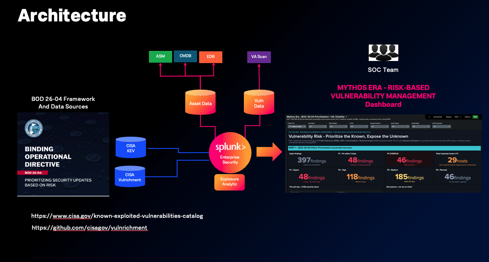

```
ASM + CMDB + EDR  ──┐
                    ├──► ea_network_asset_inventory  ──────────┐
VA Scan (Tenable) ──┘    (Exposure Analytics unified lookup)   │
                                                                ▼
CISA KEV ──────────────────────────────────────────► Splunk Enterprise Security
CISA Vulnrichment (SSVC) ──────────────────────────►   + Exposure Analytics
                                                                │
                                               BOD 26-04 Saved Search
                                                                │
                                               ┌────────────────┴───────────────┐
                                          Part 1 Dashboard             Part 2 Dashboard
                                          Known Risk                   Unknown Risk
                                          (scanned assets)             (shadow assets / blind spots)
                                                                │
                                                           SOC Team
```

See `architecture.png` for the visual diagram.

---

## Prerequisites

- **Splunk Enterprise Security** 8.5+ (Cloud or on-prem)
- **Splunk Exposure Analytics** installed with entity resolution pipeline running
- At least one EA telemetry source configured and ingesting:

| Source ID | Source | What it provides |
|---|---|---|
| 05 | CrowdStrike Falcon EDR | Endpoint telemetry, EDR coverage flag |
| 12 | Tenable.io | Vulnerability scan coverage (lastseen_12) |
| 14 / 15 | ServiceNow CMDB | CMDB registration (lastseen_14 / 15) |
| 17 | AWS EC2 | Cloud asset inventory |
| 19 | Active Directory | Identity and hostname resolution |


---

## Deployment Guide

### Step 1 - Configure data sources into Exposure Analytics

EA resolves asset identity by merging telemetry from multiple sources into a unified `ea_network_asset_inventory` lookup. Each source contributes a `lastseen_NN` timestamp per asset.

Connect your data sources in the EA configuration UI (CMDB, EDR, cloud, identity). Verify the inventory is populated:

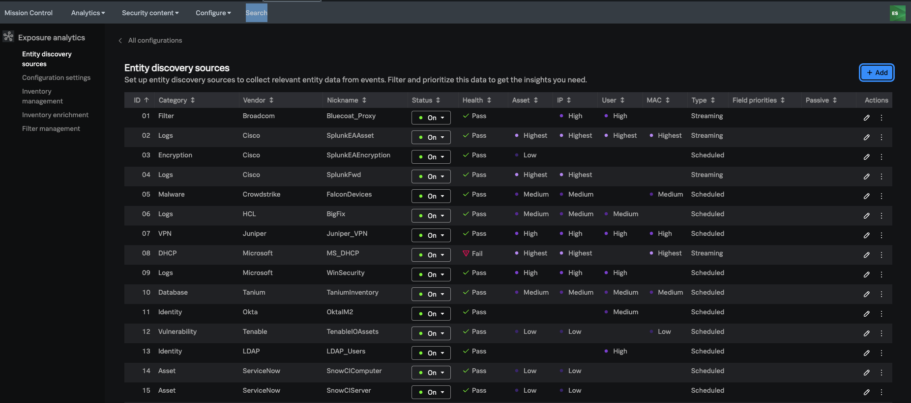

-- Verify SPL

```spl
| inputlookup ea_network_asset_inventory | stats count by asset_type
| inputlookup ea_network_asset_inventory
```

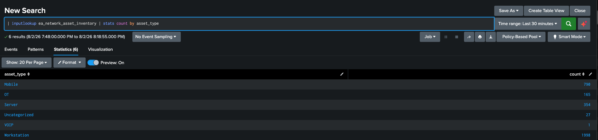

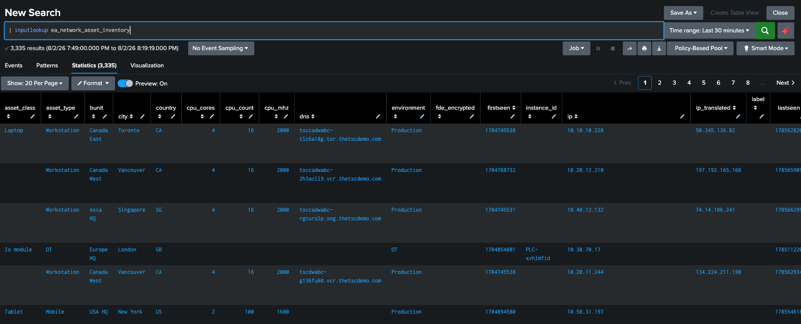


Ref:
https://help.splunk.com/en/splunk-enterprise-security-8/administer/8.5/exposure-analytics/exposure-analytics-set-up-guide-for-admins-in-splunk-enterprise-security

---

### Step 2 - Get Vulnerability scan data into Splunk

Here's the landscape of VA scan vendors with Splunk integration methods and references:

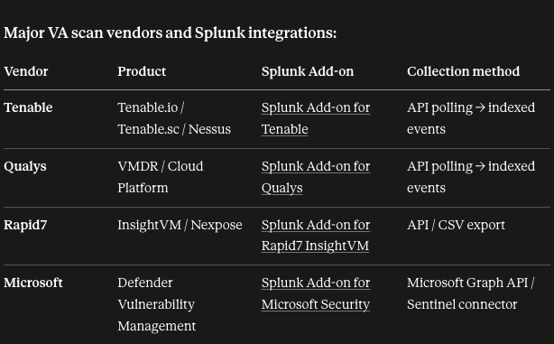


In this Demo, we have asset vulnerability from Tenable as `asset_vulnerability_data.csv` with at minimum these columns:

`Plugin ID`, `Plugin Name`, `CVE`, `CVSS v3.0 Base Score`, `Risk`, `Host`, `IP Address`, `OS`, `First Discovered`, `Last Observed`, `Vulnerability State`

Set lookup permissions: **All apps / Everyone read**.

--- Verify with SPL

```spl
| inputlookup asset_vulnerability_data.csv 
```

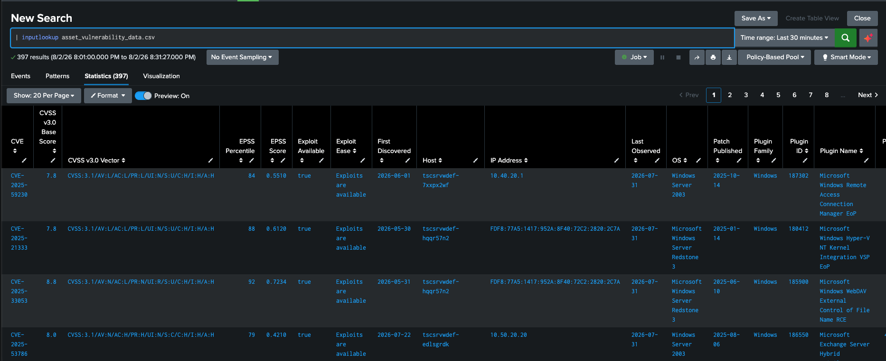

---

### Step 3 - Get exposed assets from ASM

Public exposure is the highest-weight variable in BOD 26-04. You need a list of hosts reachable from the internet. The source can be any ASM tool (Cortex Xpanse, Microsoft Defender EASM, Shodan, manual firewall review).

In this Demo, we have the asm data  as `asm_exposed_assets.csv` with columns: `nt_host`, `external_ip`, `service`, `asm_source`.

Set lookup permissions: **All apps / Everyone read**.

-- Verify SPL

```spl
| inputlookup asm_exposed_assets.csv
```
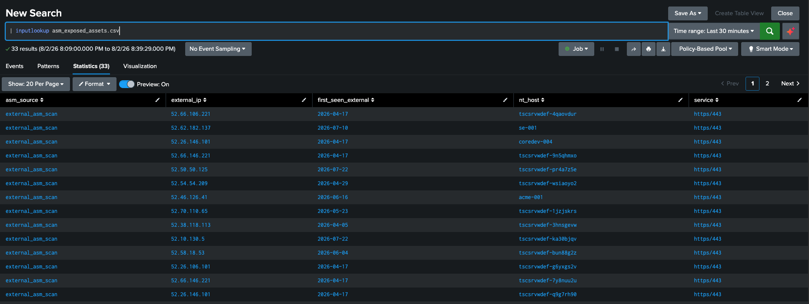

---

### Step 4 - Get the CISA KEV catalog

The CISA Known Exploited Vulnerabilities (KEV) catalog identifies CVEs with **confirmed active exploitation in the wild**. This is a binary signal - a CVE is either in KEV or it is not.

CISA publishes the KEV as a live JSON feed. Simplest production approach: schedule a Python script to pull it daily and refresh the lookup via HEC or outputlookup

In this demo, we just manually download it as below;

1. Download the CSV: https://www.cisa.gov/known-exploited-vulnerabilities-catalog
2. Upload to Splunk as a lookup named `cisa_kev_lookup.csv`
3. Set permissions: **All apps / Everyone read**

Key columns used by the saved search: `cveID`, `dateAdded`, `dueDate`, `vulnerabilityName`

-- Verify SPL

```spl
| inputlookup cisa_kev_lookup.csv
```
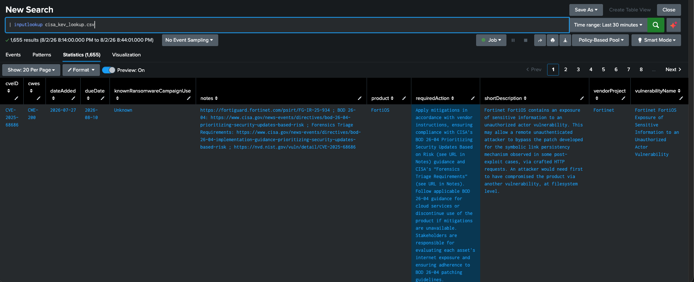
---

Ref:
https://www.cisa.gov/known-exploited-vulnerabilities-catalog

### Step 5 - Get CISA Vulnrichment (SSVC decision points)

CISA Vulnrichment provides per-CVE analyst-published SSVC decision points that map directly to three BOD 26-04 variables: **Exploitation**, **Automatable**, and **Technical Impact**.

Source: https://github.com/cisagov/vulnrichment

We can create python script (fetch_ssvc.py) to fetch SSVC data for all CVEs and ingest into Splunk:

```bash
# Option A - send directly to Splunk via HEC
export HEC_URL="https://http-inputs-<stack>.splunkcloud.com:443/services/collector/event"
export HEC_TOKEN="<your-token>"
python3 fetch_ssvc.py

# Option B - write CSV for manual upload
python3 fetch_ssvc.py
# (HEC_URL not set triggers CSV fallback)
# Then upload cisa_vulnrichment_lookup.csv to Splunk
```

After HEC ingestion, materialize the lookup with a scheduled search:

```spl
index=vuln_intel sourcetype="cisa:ssvc"
| stats last(exploitation) as exploitation
        last(automatable) as automatable
        last(technical_impact) as technical_impact by cve
| outputlookup cisa_vulnrichment_lookup.csv
```

Verify SPL

```spl
| inputlookup cisa_vulnrichment_lookup.csv
```

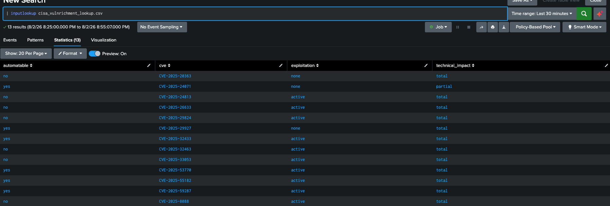
---

### Step 6 - Create the BOD 26-04 saved search

In Splunk ES, create a saved search named **"BOD 26-04 Vulnerability Prioritization"**  This is the central pipeline that joins all data sources and applies the prioritization model.

**How the search works:**

```spl
| inputlookup asset_vulnerability_data.csv
| search "Vulnerability State"!="Fixed"
| eval cve=upper(CVE)
 
``` KEV - CISA catalog ```
| lookup cisa_kev_lookup.csv cveID AS cve OUTPUT dateAdded AS kev_date_added dueDate AS kev_due_date vulnerabilityName AS kev_name
| eval in_kev=if(isnotnull(kev_date_added),"yes","no")
 
``` SSVC - CISA Vulnrichment ```
| lookup cisa_vulnrichment_lookup.csv cve OUTPUT exploitation automatable technical_impact
 
``` Asset context - EA unified inventory ```
| lookup ea_network_asset_inventory nt_host AS Host OUTPUT bunit priority AS asset_priority user_id AS owner os AS ea_os environment lastseen_14 lastseen_15 lastseen_05
 
``` Public exposure - ASM feed ```
| lookup asm_exposed_assets.csv nt_host AS Host OUTPUT external_ip service AS exposed_service asm_source
| eval exposed=if(isnotnull(asm_source),"yes","no")
 
``` EA-derived context flags ```
| eval cmdb_registered=if(isnotnull(lastseen_14) OR isnotnull(lastseen_15),"yes","no")
| eval edr_installed=if(isnotnull(lastseen_05),"yes","no")
| eval cvss=tonumber('CVSS v3.0 Base Score')
 
``` Normalize SSVC values with CVSS fallback when Vulnrichment data is missing ```
| eval ti=case(
    technical_impact="total",   "total",
    technical_impact="partial", "partial",
    cvss>=9.0,                  "total",
    true(),                     "partial")
| eval auto=case(
    automatable="yes", "yes",
    automatable="no",  "no",
    cvss>=7.0,         "yes",
    true(),            "no")
 
``` BOD 26-04: full 4-variable CISA decision tree (all 16 paths) ```
| eval base_tier=case(
    exposed="yes" AND in_kev="yes" AND auto="yes" AND ti="total",    1,
    exposed="yes" AND in_kev="yes" AND auto="yes" AND ti="partial",  1,
    exposed="yes" AND in_kev="yes" AND auto="no"  AND ti="total",    1,
    exposed="yes" AND in_kev="yes" AND auto="no"  AND ti="partial",  2,
    exposed="yes" AND in_kev="no"  AND auto="yes" AND ti="total",    1,
    exposed="yes" AND in_kev="no"  AND auto="yes" AND ti="partial",  2,
    exposed="yes" AND in_kev="no"  AND auto="no"  AND ti="total",    2,
    exposed="yes" AND in_kev="no"  AND auto="no"  AND ti="partial",  3,
    exposed="no"  AND in_kev="yes" AND auto="yes" AND ti="total",    1,
    exposed="no"  AND in_kev="yes" AND auto="yes" AND ti="partial",  2,
    exposed="no"  AND in_kev="yes" AND auto="no"  AND ti="total",    2,
    exposed="no"  AND in_kev="yes" AND auto="no"  AND ti="partial",  2,
    exposed="no"  AND in_kev="no"  AND auto="yes" AND ti="total",    3,
    exposed="no"  AND in_kev="no"  AND auto="yes" AND ti="partial",  3,
    true(), 4)
 
``` Business elevation: critical assets move up one tier (business rule - not part of CISA BOD 26-04) ```
``` DISABLED - remove this comment block to re-enable business elevation:
| eval priority_tier=if(asset_priority="critical" AND base_tier>1, base_tier-1, base_tier)
| eval elevated=if(priority_tier!=base_tier,"yes","no") ```

| eval priority_tier=base_tier
| eval elevated="no"
 
``` SLA clock ```
| eval sla_days=case(priority_tier=1,3, priority_tier=2,14, priority_tier=3,60, true(),null())
| eval first_epoch=strptime('First Discovered',"%Y-%m-%d")
| eval due_at=if(isnotnull(sla_days), first_epoch+sla_days*86400, null())
| eval due_date=strftime(due_at,"%Y-%m-%d")
| eval sla_status=case(isnull(due_at),"next_system_upgrade", now()>due_at,"overdue", true(),"within_sla")
 
``` Forensic triage: P1 with Total technical impact only (per CISA BOD 26-04) ```
| eval forensic_required=if(priority_tier=1 AND ti="total","yes","no")
| eval priority_label="P".priority_tier
 
| table priority_label forensic_required Host cve kev_name cvss in_kev exploitation automatable technical_impact exposed exposed_service elevated asset_priority bunit owner cmdb_registered edr_installed ea_os "First Discovered" due_date sla_status
| sort priority_label due_date

```

Note: lastseen_X = this is related to number of source data in EA configuration (lastseen_14,_15 = CMDB, lastseen_5 = EDR)

### The four BOD 26-04 tiers:

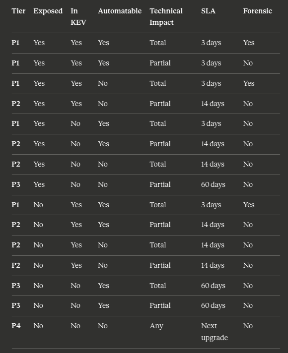

> Business Elevation: Critical assets (tagged in EA) are automatically elevated one tier — a P2 finding on a critical asset becomes P1. Elevated findings are flagged in the dashboard Elevated column.

> Forensic Triage: Required only when Priority Tier = P1 AND Technical Impact = Total. Forensic triage means assume compromise — patch AND investigate simultaneously.


Remediation Timelines Flow from BOD26-04

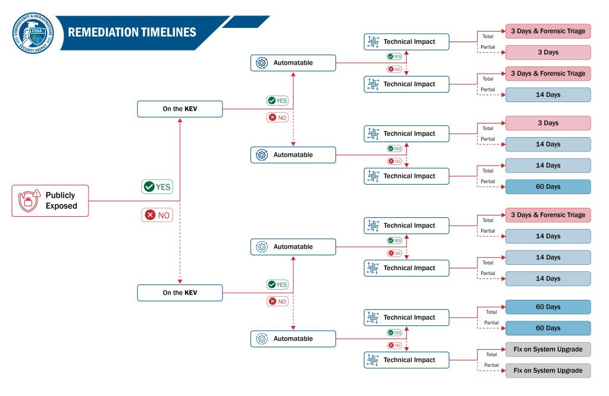


Output

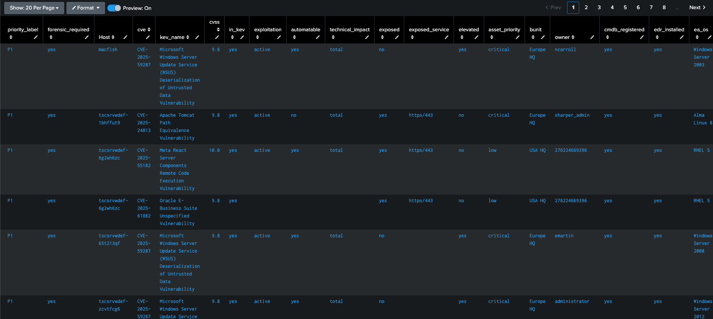

---

### Step 7 - Import the dashboard

Import `bod2604_dashboard_v2.json` into Splunk Dashboard Studio:

1. In Splunk ES, go to **Dashboards**
2. Click **Create New Dashboard > Dashboard Studio**
3. Click the **...** menu > **Edit JSON**
4. Paste the contents of `bod2604_dashboard_v2.json`
5. Save

The dashboard reads from the saved search and EA inventory lookup in real time.

---

## Dashboard Walkthrough

### Part 1 - BOD 26-04 Patch Prioritization

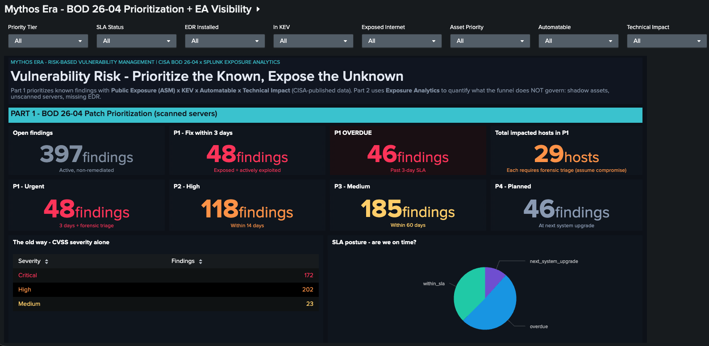


**Question answered:** *Of the vulnerabilities I know about, which ones must I fix first and by when?*

#### KPI Row

| Panel | What it shows |
|---|---|
| **Open findings** | Total active non-remediated findings from the Tenable lookup |
| **P1 - Fix within 3 days** | Findings where the host is internet-exposed AND the CVE is in CISA KEV |
| **P1 OVERDUE** | P1 findings where the 3-day SLA has already expired |
| **Total impacted hosts in P1** | Distinct hosts with at least one P1 finding - each requires forensic triage |

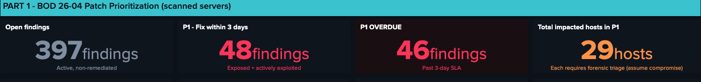

#### Tier summary (P1 to P4)

Four tiles showing finding counts per BOD tier. This is the prioritized view vs the CVSS view in the table below. Key demo point: the number of true P1 findings is far smaller than the number of Critical CVSS findings - enabling teams to focus where it actually matters.

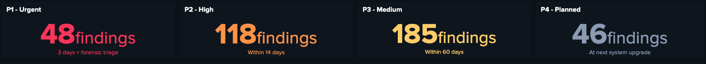

#### The old way vs the BOD way

The **"CVSS severity alone"** table shows the raw finding distribution by Critical / High / Medium / Low. Compare this to the tier tiles: most Critical CVSS findings are not P1 because they are not internet-exposed or not in KEV. The BOD model cuts through the noise.

#### SLA posture pie

Proportion of all findings by SLA status: overdue (red), within SLA (green), or P4 / next upgrade (grey). If a large slice is overdue, patching velocity must increase.

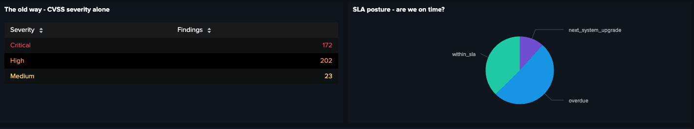

#### Prioritized worklist

Filterable table of all findings sorted P1-first, earliest due date on top. Filter by Priority Tier, SLA Status, EDR, KEV, Exposure, Asset Priority, Automatable, Technical Impact.

Key columns: Priority, Forensic flag, Host, CVE, CVSS, In KEV, Automatable, Tech Impact, Exposed, Asset Priority, Business Unit, Owner, Due Date, SLA Status, EDR.

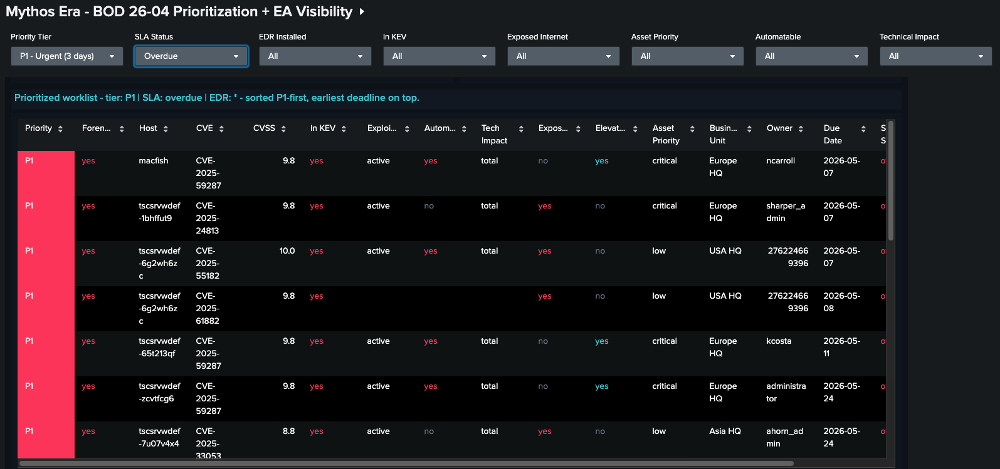
---

### Part 2 - Exposure Analytics: Unknown Risk

**Question answered:** *What is Part 1 NOT telling me?*

Part 1 only covers hosts that Tenable has scanned. Part 2 uses Exposure Analytics to quantify the blind spots.

#### KPI Row

| Panel | What it shows |
|---|---|
| **EA observed assets** | Total distinct assets EA has resolved from all telemetry sources combined |
| **Shadow assets** | Servers/workstations seen on the network but absent from CMDB - zero findings by definition, maximum unknown risk |
| **Servers without current VA scan** | Servers that have never been scanned, or whose last scan is stale (>5 days) |
| **No endpoint security** | Servers and workstations with no EDR agent - if compromised, no detection |

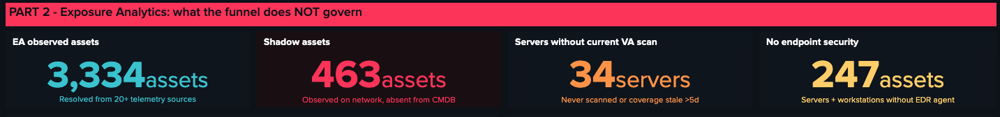

#### 2.1 Shadow assets

Lists every server/workstation that EA has observed on the network but has no CMDB record (no `lastseen_14` or `lastseen_15`). These hosts contribute **zero findings to Part 1** - not because they are secure, but because the scanner cannot reach them.

These may be rogue devices, forgotten test servers, or decommissioned machines still active on the network. **Remediation is register + scan, not patch.** These hosts must be enrolled before vulnerability management can apply.

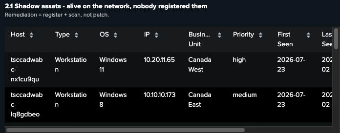

#### 2.2 Servers outside VA coverage

Lists servers that EA knows about (CMDB or EDR) but that Tenable has never scanned or whose coverage is stale:
- `never_scanned` - Tenable has no record of this host at all
- `stale_coverage` - Last scan was more than 5 days ago

**Absence of findings is not absence of risk.** These hosts likely carry the same CVE population as scanned hosts but are invisible to the prioritization model.

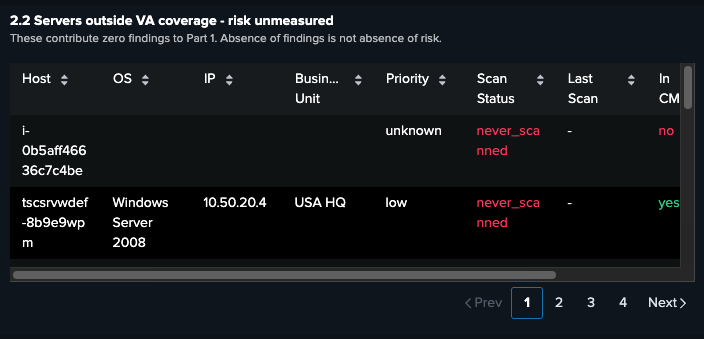

#### 2.3 Total discovered assets by type

Pie chart of the full EA estate by asset type (Server, Workstation, Network Device, etc.). This is the denominator - the universe of assets EA is aware of vs the subset that Part 1 governs. The gap between the two is the unknown risk.

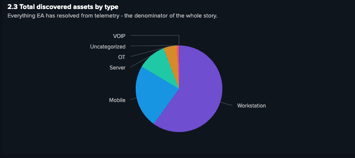

#### 2.4 Telemetry data sources feeding EA

Table of every integrated data source and how many assets it has contributed. Each source is color-coded by type (EDR, Scanner, CMDB, Cloud, Identity). Use this panel to show the customer which of their tools are already feeding EA and where gaps remain.

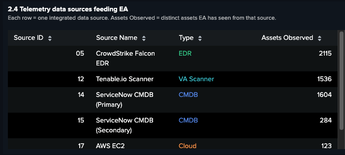
---

## Video Demo can be downloaded from below link

https://github.com/woranonv/EP2-Splunk-Mythos-CISA-BOD26-04-vuln-prioritization-Dashboard/releases/download/v1.0/Mythos_ERA_BOD26-04.Risk.Based.Dashboard.mov

## Files in this repo

| File | Purpose |
|---|---|
| `bod2604_dashboard_v2.json` | Dashboard Studio JSON - import into Splunk ES |
| `fetch_ssvc.py` | Fetches CISA Vulnrichment SSVC data, sends to Splunk HEC or writes CSV |

---

## Related resources

- [CISA BOD 26-04](https://www.cisa.gov/news-events/directives/bod-26-04-prioritizing-security-updates-based-risk) - the framework this demo implements
- [CISA KEV catalog](https://www.cisa.gov/known-exploited-vulnerabilities-catalog) - source for `cisa_kev_lookup.csv`
- [CISA Vulnrichment](https://github.com/cisagov/vulnrichment) - source for SSVC decision points

---

*Built on Splunk Enterprise Security 8.x + Splunk Exposure Analytics | CISA BOD 26-04 framework*
